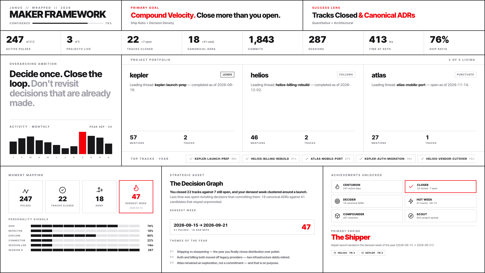
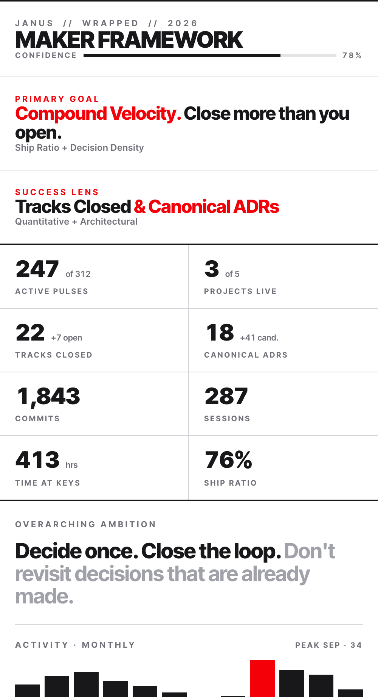

<div align="center">

# Janus

**The personal historian for makers.**

[](https://github.com/crewtives/janus/actions/workflows/ci.yml)
[](LICENSE)
[](https://bun.sh)

Other tools compile what you know. Janus records what you did.

Janus reads your work (git + Claude Code sessions) and writes the narrative of each project across five tiers — daily → weekly → monthly → quarterly → yearly → spine — straight into your Obsidian vault. The vault becomes both a journal future-you can re-read and an MCP server other agents can query for context — not raw logs.

Built by **[Crewtives](https://crewtives.com)** · [Read the notes](https://crewtives.com/notes/)

[Architecture](docs/ARCHITECTURE.md) · [MCP server](docs/mcp.md) · [FAQ](docs/FAQ.md) · [Status](docs/STATUS.md) · [Handoff](docs/HANDOFF.md) · [Contributing](CONTRIBUTING.md) · [Changelog](CHANGELOG.md)

</div>

---

<p align="center">
  
</p>

<p align="center">
  <em><code>janus demo</code> materializes a synthetic vault — no Obsidian or Claude Max required.</em>
</p>

<div align="center">
  <table>
    <tr>
      <td>
        <a href="docs/examples/wrapped-2026-sample.html">
          
        </a>
      </td>
      <td>
        <a href="docs/examples/wrapped-2026-sample.html">
          
        </a>
      </td>
    </tr>
  </table>
</div>

<p align="center">
  <em>The yearly Wrapped flagship — same data, two layouts (synthetic, three fake projects).</em>
</p>

## What it does

Every night, Janus walks each of your tracked projects and writes:

- **Daily pulse per project** — what shipped, what got stuck, what was decided, what stayed in flight. Prose, not bullets.
- **Daily cross-project rollup** — synthesizes today's pulses into one note you read in 60 seconds.
- **Weekly arcs, monthly digests, quarterly retros, yearly retrospectives** — each tier compounds the one below into a narrative the next reader (human or agent) can pick up cold.
- **Per-project spine** — a continuous Wikipedia-style note that explains the project from scratch in 600 words. Updated, not regenerated.
- **Janus Wrapped** — a flagship yearly retrospective at year close and on project anniversaries. Stat dashboards show numbers; Janus Wrapped writes the actual paragraph of what your year was about — per-project plus a global yearly, a maker personality archetype derived from behavior, top tracks, biggest decision. Markdown, HTML, and PNG export.

> [See a synthetic Wrapped sample →](docs/examples/wrapped-2026-sample.md) (three fake projects, no real user data)

The system runs on the **Claude Code CLI** (or Gemini CLI as fallback) via headless invocation, so it uses your Claude Max subscription instead of burning API tokens. It exposes itself as an **MCP server** with 4 tools so other agents can query the synthesized narrative.

## Cost

Janus is free if you already pay for **Claude Max**. The runner shells out to `claude -p` headless, which authenticates against your local OAuth session — no `ANTHROPIC_API_KEY` is consumed, no API tokens are billed. If `claude` isn't available, the optional `gemini-cli` fallback runs against your Google account on the same principle.

The only command that incurs multiple LLM calls in a single run is `wrapped` (one yearly + per-project + personality). Use `--dry-run` while iterating on prompts; it skips the LLM and exercises only the deterministic aggregator + personality.

## Why

Builders running several projects in parallel lose the thread by Friday. Git logs say what shipped. Session transcripts say what was tried. The synthesis between the two — the *narrative* of your work — is what you actually need to remember three months later. Janus writes that narrative every night so your future self has it.

Two existing strategies fall short for this:

- **Dashboards and cost trackers** tell you *how much* — sessions, tokens, dollars — but not *what it meant*. You don't re-read a dashboard at 11pm.
- **Wikis and second brains** compile *what you know* — concepts, decisions, patterns — but group by topic, not by time. The thread of *this week*, *this quarter*, *this year* is lost.

Janus does the third thing. It groups by **night of work**, writes prose (not bullets), and compounds those nights into weeks, months, quarters, years, and a per-project spine. Future-you reads a paragraph; future-agents query an MCP server. Same vault.

The moat is the **quality of synthesis** and the **temporal compaction hierarchy**, not the universality of output. We don't export to Notion or Linear — we own the narrative layer.

## Who it's for / not for

**For you if** you're running two or more projects in parallel, you already live in Obsidian, you're willing to invest a Claude Max subscription (or a `gemini-cli` setup) in remembering your own work, and you'd rather read a paragraph than a dashboard.

**Not for you if** you work on a team and need shared workspaces (Janus is single-user by design — no seats), you don't use Obsidian (Markdown-everywhere is the sink, dashboards and wikilinks assume it), you want push-button reports into Notion / Linear / Confluence (export to other systems is explicitly out of scope), you want an encyclopedia of *what you've learned* (Janus writes the journal, not the wiki), or you want a dashboard of AI session cost and tokens (Janus writes prose, not metrics).

See [docs/FAQ.md](docs/FAQ.md) for the longer answer to most of the questions this prompts.

## Stack

- **Bun** + TypeScript · **citty** CLI · **@clack/prompts** wizard
- **bun:sqlite** for state, FTS5 search index, project metadata, track lineage, decision graph
- **p-queue** + **p-retry** with per-project serialization, cross-project concurrency
- **Eta** templating for versioned prompts (single shared voice spec)
- Cross-platform nightly scheduler — **launchd** (macOS), **systemd-user timer** (Linux + WSL)
- **LLMRunner abstraction** with swappable adapters (`claude-code`, `gemini-cli`)
- Vanilla JSON-RPC stdio MCP server, zero external dependencies

## Install

### For users — prebuilt binary

```bash
curl -fsSL https://raw.githubusercontent.com/crewtives/janus/main/scripts/install-binary.sh | bash
janus init
```

The script detects your OS and architecture (macOS arm64 / x64, Linux x64 / arm64), downloads the matching binary from the latest GitHub release, verifies the SHA256 checksum, and installs to `~/.local/bin/janus`. Override with `JANUS_VERSION=v0.3.0` to pin a release or `JANUS_INSTALL_DIR=…` to install elsewhere.

> **macOS users**: Gatekeeper may quarantine the binary on first run. The installer prints the exact `xattr -d com.apple.quarantine …` incantation if needed. Code-signing + notarization is on the roadmap.

### With an AI coding agent (one-shot)

If you use **Claude Code**, **Codex**, or **Cursor**, paste the prompt below into a fresh session. The agent will detect your platform, install Janus, verify it, and hand you off to `janus init`. Nothing in this prompt is Janus-specific magic — it's the same steps the installer script runs, written so an agent can supervise them with the right error handling and ask for your confirmation at the points that matter.

````markdown
Install Janus on this machine — it's a personal historian for makers that reads
my git + Claude Code sessions and writes a continuous narrative of my projects
into Obsidian. The full README is at https://github.com/crewtives/janus.

Walk these steps in order, pausing if anything looks wrong:

1. Detect OS + arch with `uname -s` and `uname -m`. Janus ships binaries for
   `macos-arm64`, `macos-x64`, `linux-x64`, `linux-arm64`. If I'm on native
   Windows, stop and tell me to use WSL.

2. Resolve the latest release tag from `crewtives/janus` — use
   `gh release view --repo crewtives/janus --json tagName,assets` if `gh` is
   installed, otherwise `curl -fsSL https://api.github.com/repos/crewtives/janus/releases/latest`.

3. Download the matching `janus-<os>-<arch>` binary AND the `SHA256SUMS` file
   to a temp directory. Verify the binary's SHA256 matches the line in
   `SHA256SUMS`. If it doesn't, stop and report — do not install an unverified
   binary.

4. Move the verified binary to `~/.local/bin/janus`, `chmod +x` it, and on
   macOS strip the quarantine flag with
   `xattr -d com.apple.quarantine ~/.local/bin/janus` (ignore the error if
   it isn't quarantined).

5. Confirm `~/.local/bin` is on my `PATH`. If not, append
   `export PATH="$HOME/.local/bin:$PATH"` to my shell rc (`~/.zshrc` on
   macOS, `~/.bashrc` on Linux) and tell me to `source` it in this session.

6. Run `janus --version` and confirm the output matches the release tag from
   step 2.

7. Tell me to run `janus init` next. **Do not run it for me** — it's an
   interactive wizard that picks a language, detects Claude Max auth, scans
   for Obsidian vaults and git repos, writes `config.local.json`, and
   optionally installs the nightly scheduler. I need to be at the keyboard.

8. After I've finished `janus init`, offer to run `janus doctor` and
   `janus pulse --backfill 7d --dry-run` to validate the setup, but wait for
   my OK before running them.

A few things that should shape your choices:

- Janus needs **Claude Max** (or `gemini-cli` as a fallback) to actually
  generate pulses. If neither is configured, surface it during step 7 — `init`
  will tell me, but you can save me a round-trip.
- The only command that incurs multiple LLM calls is `wrapped` (yearly). If I
  ask you to backfill long periods, the dry-run flag is the safe default.
- Don't run `sudo` — `~/.local/bin` is per-user on purpose.
````

### For developers — from source

```bash
git clone https://github.com/crewtives/janus.git ~/janus
cd ~/janus
bun install
bun janus init
```

Or `curl | bash` the developer installer:

```bash
curl -fsSL https://raw.githubusercontent.com/crewtives/janus/main/scripts/install.sh | bash
```

The `init` wizard (run after either install path):
1. Picks language (English / Español) for the rest of the wizard.
2. Detects Claude Max auth.
3. Scans for Obsidian vaults and git repos.
4. Writes `config.local.json` (idempotent — re-running enters re-check mode).
5. Optionally installs the nightly scheduler (launchd/systemd-user).
6. Runs `doctor` + a dry-run pulse to validate the setup.

## Quickstart

```bash
# First run: backfill the last 7 days for all configured projects
bun janus pulse --backfill 7d

# Roll up the week (also materializes cross-project tracks + regenerates spines)
bun janus rollup --week

# Search the vault
bun janus ask "Globex OAuth"

# Expose Janus as an MCP server to other Claude Code sessions
bun janus mcp
```

## Commands

```bash
# Daily pulse
bun janus pulse                              # yesterday, all projects
bun janus pulse --backfill 7d                # last 7 days (first run)
bun janus pulse --project <name>             # one project
bun janus pulse --dry-run                    # render prompt without invoking LLM

# Rollups + retros
bun janus rollup --week                      # consolidate the last 7 days
bun janus monthly --month YYYY-MM            # monthly digest
bun janus quarterly --quarter YYYY-Q?        # quarterly retrospective
bun janus yearly --year YYYY                 # yearly retrospective
bun janus spine [--project <name>]           # regenerate continuous narrative

# Janus Wrapped (Phase 3 flagship)
bun janus wrapped --year YYYY                # yearly cross-project Wrapped
bun janus wrapped --year YYYY --project N    # per-project Wrapped
bun janus wrapped --year YYYY --format html  # HTML self-contained
bun janus wrapped --year YYYY --format png   # PNG (requires puppeteer)
bun janus wrapped --year YYYY --dry-run      # data + personality only

# Search + MCP
bun janus index                              # bootstrap FTS5 index
bun janus ask "<query>" [--project X] [--since YYYY-MM-DD] [--kind pulse|weekly|...]
bun janus mcp                                # stdio MCP server: janus_ask, janus_get_spine, janus_get_pulse, janus_list_projects

# Portfolio notes
bun janus note "<topic>" [--title "..."] [--project <name>] [--dry-run]

# ADRs (Architecture Decision Records)
bun janus adr {create,promote,list}

# Discovery + maintenance
bun janus discover [--apply]                 # find new git repos in discoverRoots
bun janus archive-tracks [--ttl-weeks N]
bun janus retry --from .janus/failed.jsonl   # replay dead-letter queue
bun janus doctor                             # provider-aware diagnostics
```

## Configuration

The wizard writes `config.local.json`. Sample shape:

```json
{
  "obsidianVault": "~/Obsidian",
  "projects": [
    { "name": "my-project", "repoPath": "~/code/my-project", "obsidianPath": "~/Obsidian/Projects/my-project", "status": "active" }
  ],
  "discoverRoots": ["~/code/*"],
  "provider": "claude-code",
  "fallbackProvider": "gemini-cli",
  "model": "sonnet",
  "fallbackModel": "opus",
  "effort": "xhigh",
  "language": "en"
}
```

Per-project `status`:
- `active` (default) — pulses every day.
- `paused` — only generates a pulse if there's commit/session activity. Useful for side projects that sleep for weeks.
- `archived` — total skip.

## What's in the vault after a run

Janus generates idempotent artifacts in your Obsidian vault:

```
~/Obsidian/
├── Timeline/
│   ├── Daily/YYYY-MM-DD.md             # cross-project daily rollups
│   ├── Weekly/YYYY-MM-DD-week.md       # weekly arcs
│   ├── Monthly/YYYY-MM-monthly.md      # monthly digests
│   ├── Quarterly/YYYY-Qn.md            # quarterly retros
│   └── Yearly/YYYY-yearly.md           # yearly retrospectives
├── Projects/<name>/
│   ├── pulse/YYYY-MM-DD--<name>.md     # per-project pulses
│   ├── <name>.md                       # hub note
│   ├── <name>-spine.md                 # continuous narrative
│   ├── _index.md                       # dataview dashboard
│   └── _archive/YYYY-MM/               # auto-archived pulses
├── MOCs/{Projects,Decisions,Risks,Tracks,Weekly}-MOC.md
├── MOCs/Tracks/<slug>.md               # materialized cross-project tracks
├── Dashboards/{Janus Pulse, Open Risks, Drift, Inferring}.md
├── Notes/YYYY-MM-DD-<slug>.md          # portfolio drafts (via `janus note`)
├── Wrapped/Wrapped-YYYY.md             # yearly Wrapped flagship
└── Decisions/ADR-NNN-<slug>.md         # promoted ADRs
```

## MCP server

The narrative isn't just for you to read. `bun janus mcp` launches a stdio JSON-RPC server exposing 4 tools any agent can call — so other Claude Code sessions, scripts, or coding agents can query your own history as structured context instead of asking you to re-explain it.

- `janus_ask(query, project?, since?, kind?)` — FTS5 search returning narrative excerpts.
- `janus_get_spine(project)` — continuous per-project narrative.
- `janus_get_pulse(project, date)` — specific pulse.
- `janus_list_projects()` — projects with status + last pulse.

Wire it into your `.mcp.json` so other Claude Code sessions can query Janus directly. See [docs/mcp.md](docs/mcp.md).

## The /daily-pulse skill

Janus ships a Claude Code skill so you can drive it in natural language from any session — "run the daily pulse", "reprocess the 18th", "weekly rollup", "discover new projects" — and the skill maps the request to the right `janus` command.

`janus init` offers to install it. To do it yourself (or on a binary-only install where the wizard skips it):

```bash
bash scripts/install-skill.sh   # symlinks skill/ → ~/.claude/skills/daily-pulse
```

Then type `/daily-pulse` in any Claude Code session. The skill calls the `janus` binary on your PATH; if you run from source without the global binary, its commands fall back to `bun run bin/janus.ts`.

## Documentation

- [docs/FAQ.md](docs/FAQ.md) — common questions before and after installing.
- [docs/STATUS.md](docs/STATUS.md) — current product state, what's shipped per phase.
- [docs/HANDOFF.md](docs/HANDOFF.md) — single-document onboarding for a new contributor or agent.
- [docs/ARCHITECTURE.md](docs/ARCHITECTURE.md) — end-to-end diagrams, technical decisions, vault structure.
- [docs/PRIVACY.md](docs/PRIVACY.md) — what Janus redacts before sending prompts to the LLM, and how to extend or disable it.
- [docs/mcp.md](docs/mcp.md) — MCP server usage.
- [ROADMAP.md](ROADMAP.md) — what's coming next.
- [CHANGELOG.md](CHANGELOG.md) — release history.

## Phase status

- **Phase 1** (Foundations) ✅ — voice consistency, bookkeeping metadata, MCP server.
- **Phase 2** (Reflection layer) ✅ — open loops, stuck patterns, pattern detection, anniversaries, "this day, last year", reflection prompts.
- **Phase 3** (Janus Wrapped) ✅ — yearly + per-project Wrapped, personality archetypes, HTML/PNG export, trickle release.

Full history in [docs/HANDOFF.md](docs/HANDOFF.md).

## Contributing

Contributions are welcome. Start with [CONTRIBUTING.md](CONTRIBUTING.md) — it covers local setup, the dev loop (`bun test && bunx tsc --noEmit && bun run scripts/smoke-validate-phase1.ts`), commit conventions, and PR review expectations.

If you're an AI coding agent (Claude Code, Codex, Cursor, etc.), read [AGENTS.md](AGENTS.md) first — it carries the repo conventions and the non-obvious decisions that look like oversights until you understand them. Claude Code has an additional companion file at [CLAUDE.md](CLAUDE.md).

Security issues: don't open a public issue. See [SECURITY.md](SECURITY.md) for the private reporting channel.

This project follows the [Contributor Covenant](CODE_OF_CONDUCT.md).

## License

[MIT](LICENSE). © 2026 Crewtives.

---

<div align="center">

Made by **[Crewtives](https://crewtives.com)** — agent-native products and infrastructure.

</div>
