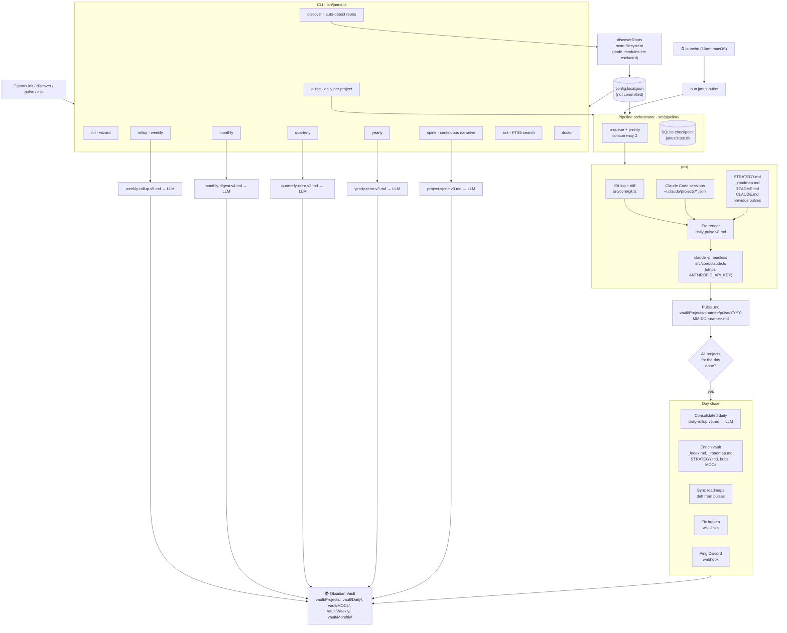
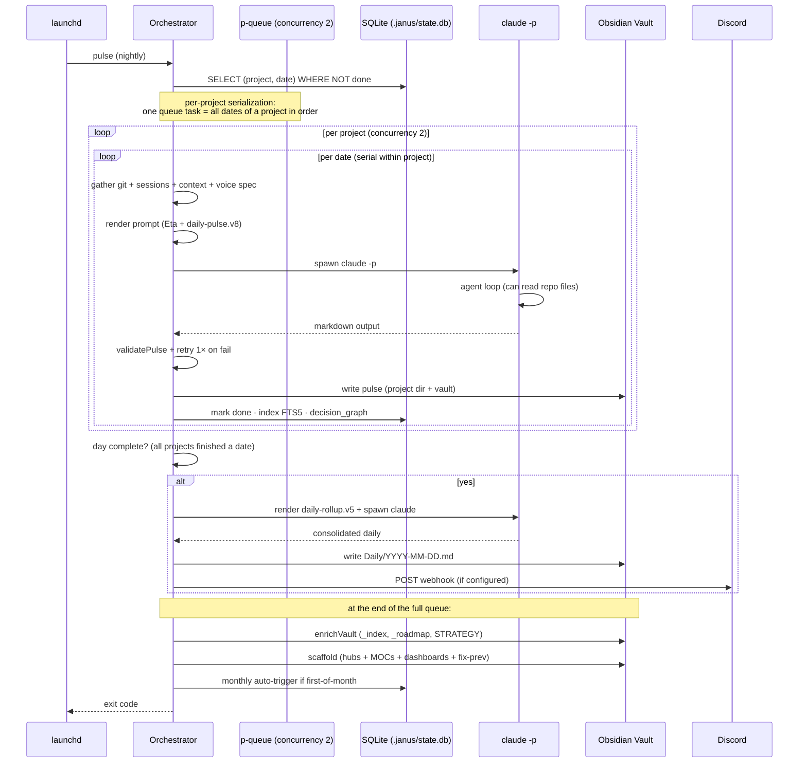

# Janus architecture

Janus is a **nightly agent** that distills your project activity into a continuous engineering narrative, persisted in your Obsidian vault. It runs on top of Claude Code in headless mode (`claude -p`) against your Claude Max subscription — no API tokens consumed.

## Overview



## Commands

| Command | What it does | Prompt used |
|---------|----------|--------------|
| `init` | Interactive onboarding wizard. Detects auth, vault, projects. Optionally installs launchd. | — |
| `discover` | Detects new git repos in `discoverRoots`. `--apply` adds them to the config. | — |
| `pulse` | Generates a daily pulse for each project. Closes the day with consolidated rollup + enrich + scaffold + Discord. | `daily-pulse.v8`, `daily-rollup.v5` |
| `rollup --week` | Cross-project weekly consolidation + materializes tracks + regenerates spines. | `weekly-rollup.v5` |
| `monthly` | Monthly digest. Archives the month's pulses to `_archive/`. | `monthly-digest.v4` |
| `quarterly` | Quarterly retrospective consolidating the monthlies. | `quarterly-retro.v3` |
| `yearly` | Yearly retrospective consolidating the 4 quarterlies. | `yearly-retro.v3` |
| `spine` | Regenerates the continuous narrative per project. | `project-spine.v3` |
| `ask <query>` | Full-text search (FTS5) over the vault. | — |
| `index` | Rescans + rebuilds the FTS5 index. | — |
| `mcp` | Starts the MCP stdio server. 4 tools: ask, get_spine, get_pulse, list_projects. | — |
| `note <topic>` | Generates a Note draft for the portfolio (crewtives.com/notes/ style). Reads relevant material from the vault via FTS5 + voice spec + few-shot from the portfolio. | `note-draft.v2` |
| `wrapped --year YYYY` | Annual retrospective (cross-project or `--project`); `--format markdown\|html\|png`. | `wrapped-yearly.v3`, `wrapped-project.v2`, `wrapped-personality.v2` |
| `demo` | Generates a throwaway sample vault + Wrapped to preview output without real data. | — |
| `adr` | Manages ADRs (Architecture Decision Records). | — |
| `archive-tracks` | TTL for tracks not mentioned in the last N weeklies. | — |
| `doctor` | 14+ validations (git, claude, Max auth, paths, etc.). | — |
| `retry` | Reprocesses failed tasks from `.janus/failed.jsonl`. | — |

All versioned prompts inject **`src/prompts/_voice.md`** as the single narrative voice spec (Phase 1A — voice consistency overhaul). See `docs/eval/voice-overhaul.md` for the side-by-side evaluation flow.

## Vault structure

```
~/Obsidian/
├── Projects/
│   └── <project-name>/
│       ├── <name>.md                # main hub (generate-hubs)
│       ├── <name>-spine.md          # continuous narrative (rollup --week)
│       ├── _index.md                # auto: project dashboard (enrichVault)
│       ├── _roadmap.md              # auto: roadmap draft (enrichVault, idempotent)
│       ├── STRATEGY.md              # auto: template (enrichVault, idempotent)
│       ├── pulse/
│       │   ├── 2026-05-20-<name>.md
│       │   └── 2026-05-21-<name>.md
│       └── _archive/                # old pulses (monthly digest)
├── Daily/
│   ├── 2026-05-21.md                # cross-project consolidation for the day
│   ├── Weekly/
│   │   └── 2026-05-20-week.md       # weekly rollup
│   ├── Monthly/
│   │   └── 2026-05-monthly.md
│   ├── Quarterly/
│   │   └── 2026-Q2.md
│   └── Yearly/
│       └── 2026-yearly.md
├── MOCs/                            # cross-project Maps of Content (generate-mocs)
│   ├── Projects MOC.md
│   ├── Decisions MOC.md
│   ├── Risks MOC.md
│   ├── Tracks MOC.md
│   ├── Weekly MOC.md
│   └── Tracks/                      # tracks materialized from weeklies
│       ├── <slug-1>.md
│       └── <slug-2>.md
├── Dashboards/                      # global views (generate-dashboards)
│   ├── Janus Pulse.md               # global cross-project view
│   ├── Open Risks.md                # pulses with risks > 0
│   ├── Drift.md                     # pulses with status = some-drift
│   └── Inferring.md                 # pulses without a roadmap
├── Notes/                           # drafts for public portfolio (bun janus note)
│   └── <YYYY-MM-DD>-<slug>.md       # crewtives.com/notes/ style
└── Decisions/                       # canonical ADRs promoted from pulses
    └── ADR-NNN-<slug>.md
```

## Tech stack

- **Bun** + TypeScript + ES modules — single runtime, no heavy tooling
- **citty** — declarative CLI with lazy-loaded subcommands
- **p-queue + p-retry** — orchestration with concurrency and backoff
- **bun:sqlite** — checkpoint + cross-project FTS5 index
- **Eta** — prompt templating (jinja-like over the `.md` files in `src/prompts/`)
- **@clack/prompts** — interactive `janus init` wizard
- **launchd** (macOS) — nightly scheduling
- **LLMRunner abstraction** — swappable adapters (`claude-code`, `gemini-cli`)

## LLMRunner — provider abstraction

Janus invokes coding-agent CLIs in headless mode through a neutral contract. This lets it work with Claude Code or Gemini CLI (and add adapters for Qwen Code, Codex, etc.) without locking the orchestrator to a specific vendor.

```
src/runners/
├── types.ts            ← LLMRunner interface + RunnerCapabilities + RunOptions/Result
├── claude-code.ts      ← Claude Code adapter (stream-json, --tools "", strips ANTHROPIC_API_KEY)
├── gemini.ts           ← Gemini CLI adapter (--output-format json single response)
├── registry.ts         ← resolveRunner(config) → factory by provider
├── with-fallback.ts    ← wrapper that retries with the secondary runner on retriable errors
└── util.ts             ← streamLines, drainToString, safeParse, cleanEnv
```

### Contract decisions

| Decision | Why |
|---|---|
| **Prompt always via STDIN** | Universal across CLIs and avoids argv size limits with large prompts (75K+ chars) |
| **Capability flags per adapter, not LCD** | Each runner declares what it supports (`effortControl`, `addDirs`, `sessionResume`, `costTracking`, `jsonStream`, `disableTools`, `fallbackModel`). Call sites respect or ignore on purpose |
| **Timeout/abort in the wrapper, not via a CLI flag** | Not every CLI has a timeout flag; we handle it with `Bun.spawn({ timeout })` or `AbortSignal` |
| **Hybrid fallback** | If the adapter supports a native `--fallback-model`, it's delegated (more efficient); otherwise, `withFallback(primary, secondary)` retries with another runner on `retriable` errors |
| **Cost is null when not reported** | We never estimate costs if the provider doesn't expose them — explicit null vs misleading number |
| **`RunnerError.retriable` flag** | Each adapter classifies its exit codes (overload, rate-limit, network = retriable; auth missing, invalid input = not). The orchestrator only retries what's worth retrying |

### Provider selection in config

```json
{
  "provider": "claude-code",          // primary
  "fallbackProvider": "gemini-cli",   // optional, for failover
  "model": "sonnet",
  "fallbackModel": "opus"
}
```

`doctor` reads `config.provider` + `config.fallbackProvider` and only checks the CLIs that will be used. If you only use Gemini, it doesn't verify `claude auth status`. If you have a fallback configured, it validates both.

`resolveRunner(config)` returns the runner to use; the 7 call sites (orchestrator, aggregations, monthly, spine, daily, weekly) call `resolveRunner(config).run(opts)` instead of the historical `runClaude(opts)`.

## Key decisions

### Why headless CLI instead of direct API

Janus is designed to run every night across multiple projects. Doing that with API tokens would be expensive and misaligned with the "personal agent" use case. We reuse subscriptions the user already pays for:

- **Claude Code adapter**: `cleanEnv(env, ["ANTHROPIC_API_KEY"])` strips the API key from the subprocess env, forcing Max OAuth.
- **Gemini CLI adapter**: if `~/.gemini/credentials.json` (OAuth login) is present, it uses that; alternative: `GEMINI_API_KEY`/`GOOGLE_API_KEY` for cases without a subscription.
- It also gives us access to the **agent's tools** (file read/write, bash, web fetch, etc.) inside every pulse — the LLM doesn't just write, it can also read a specific file in the repo when the commit warrants it.

### Why coding-agent session transcripts (not just git)

Git tells you **what was committed**. Claude Code sessions (`.jsonl` files in
`~/.claude/projects/<slug>/`) tell you **what was decided, what blocked, what
was tried and discarded**. The engineering narrative lives there.

`src/core/sessions.ts` extracts:
- `userIntent` (first user message in the session)
- `decisionSnippets` (regex heuristic over "decided", "chose",
  "implemented", "fixed", etc.)
- `blockerSnippets` ("failed", "error", "stuck", etc.)

This feeds the prompt alongside git log + STRATEGY.md + roadmap + previous
pulses.

### Why Obsidian (not GitHub Pages, not Notion)

Obsidian works local-first over plain markdown. That means:
- Pulses live in git (in each project's repo) AND in the Obsidian vault —
  duplicated on purpose, redundant sources.
- Natural wiki-links: `[[crewtives-janus]]`, `[[2026-05-21]]`,
  `[[STRATEGY]]`. Obsidian renders the graph.
- No cloud dependencies, no auth.
- Composable with scripts (`enrich-vault.ts`, `fix-broken-links.ts`,
  `sync-roadmaps.ts`).

### Why versioned prompts (`daily-pulse.v8.md`)

Each prompt goes to a file with a `.vN.md` suffix. That lets us:
- Iterate without losing previous versions (commit history).
- Regenerate the entire vault with a new prompt (`scripts/regenerate-dailys.ts`).
- A/B test prompt changes by isolating "before" vs "after".

### Why cross-project compounding

Each project on its own is a daily pulse. But the real value shows up
**crossing projects and time**:

- **Consolidated daily**: what happened today across ALL projects together.
- **Weekly rollup**: the week's emerging pattern.
- **Monthly digest**: themes that persisted.
- **Quarterly / Yearly**: long-term narrative arc.
- **Spine**: for EVERY project, a continuous narrative that keeps
  accumulating — not a dump of pulses, but a distilled story.

This is what Janus does that tools like `git-standup` or `WakaTime`
don't.

### Shared narrative voice (Phase 1A)

`src/prompts/_voice.md` is the **single spec** for how Janus writes. The 7 versioned prompts inject it via `<%= it.voice %>` at the start. Voice changes are made in a single file, not in 7.

Hard voice rules (summary — see `_voice.md` for the full detail):
1. Prose > bullets (paragraph by default, bullets only for inherently list-like content).
2. Soft third-person narrator ("the day centered on", not "you did").
3. Product-level language, not file-level.
4. No empty adjectives ("solid", "productive", "interesting").
5. Concreteness + evidence (every claim with a citable commit/session/date).
6. Cumulative temporal continuity.
7. No disclaimers or meta-commentary.
8. Honesty (if it was slow, say so).

### Bookkeeping persisted in SQLite (Phase 1C)

In addition to `pulse_state` (idempotency) and `pulse_baseline` (feedback loop), Janus maintains 3 tables that enable reflection and Wrapped:

| Table | Purpose | Enables |
|---|---|---|
| `project_metadata` | birth dates (first git commit + first pulse) per project | Anniversary detection (Phase 2 U7), Wrapped birthdays (Phase 3) |
| `track_lineage` | first_seen, last_mentioned, mentions_count, status per (slug, project) | Open-loop detection (Phase 2), Wrapped top-tracks (Phase 3) |
| `decision_graph` | ADR-NNN / candidates / modifies / reverts references from each pulse | Orphan decision detection (Phase 2), biggest decision in the Wrapped (Phase 3) |

The orchestrator persists these tables automatically: `track_lineage` from `weekly.ts`/`monthly.ts` after `materializeTracks()`; `decision_graph` from `orchestrator.ts` after every `writePulse`. Lazy: `project_metadata` is populated when explicitly requested (24h cache).

### MCP server (Phase 1D)

`src/mcp/server.ts` exposes Janus as an **MCP stdio server** consumable from Claude Code, Cursor, Codex in other sessions. Vanilla JSON-RPC 2.0 newline-delimited, no dependencies (~250 LOC). 4 typed tools:

- `janus_ask(query, project?, since?, kind?, ...)` — FTS5 search with filters, results returned as narrative with back-links.
- `janus_get_spine(project)` — returns the full project-spine.
- `janus_get_pulse(project, date)` — specific pulse (searches in `pulse/` and `_archive/`).
- `janus_list_projects()` — projects + status + latest pulse.

CLI: `bun janus mcp`. Connection documented in `docs/mcp.md`, including the **Janus vs companion-agent** contrast (Janus = synthesized narrative, companion-agent = raw memory — complementary layers).

### Vault scaffolding (Phase 1A + post-process)

After every complete `pulse` (not per-date — at the close of the full queue), the orchestrator fires the scaffold chain to guarantee that the graph in Obsidian ends up without broken wiki-links:

1. `enrichVault()` — `_index.md`, `_roadmap.md` draft, `STRATEGY.md` template per project (in-process, already existed).
2. `scripts/generate-hubs.ts` — `<name>.md` hubs per project with dataview.
3. `scripts/generate-mocs.ts` — 5 cross-project MOCs.
4. `scripts/generate-dashboards.ts` — 4 global dashboards (`Janus Pulse`, `Open Risks`, `Drift`, `Inferring`).
5. `scripts/fix-pulse-anterior-links.ts` — deterministic post-process that repairs the `Previous pulse: [[...]]` line when the LLM hallucinated it (common in pulses with status=idle).

All idempotent (`--force` to overwrite). `scripts/scaffold-vault.ts` chains them for manual use.

## Operational pipeline



## Idempotency and dead-letter

- `(project, date) → done` in `.janus/state.db` — re-running an already
  processed day is a no-op (unless `--force` is passed).
- Failures go to `.janus/failed.jsonl` (dead-letter queue).
- `bun janus retry --from .janus/failed.jsonl` reprocesses them.
- All enrich logic (`maybeRegenerateRoadmap`, `maybeCreateStrategy`)
  respects user edits via frontmatter flags (`needs_review: false`).

## Privacy and security

- **Redaction layer**: `src/core/privacy/redact.ts` strips secrets/PII (API keys,
  tokens, emails) and collapses paths (`$HOME` → `~`, repo root → `<repo>`) from
  every prompt. It's wired in `resolveRunner()` via `src/runners/redacting.ts`, a
  bypass-resistant chokepoint — any caller that goes through the registry is
  covered. Opt out with `config.privacy.enabled = false`. See `docs/PRIVACY.md`.
- **Discord webhook** is bearer-equivalent: `.gitignore` covers
  `config.local.*` (including `*.bak.*` backups) since commit `92fe82e`.
- **Claude Max auth** lives in the macOS Keychain, never on disk or in config.
- **launchd plist**: `src/core/init/launchd.ts` XML-escapes all string
  values to prevent injection via paths containing `<`, `>`, `&`.

## Setup

```bash
git clone <repo>
cd <repo>
bun install
bun janus init     # interactive wizard
```

See `README.md` for the manual flow.
