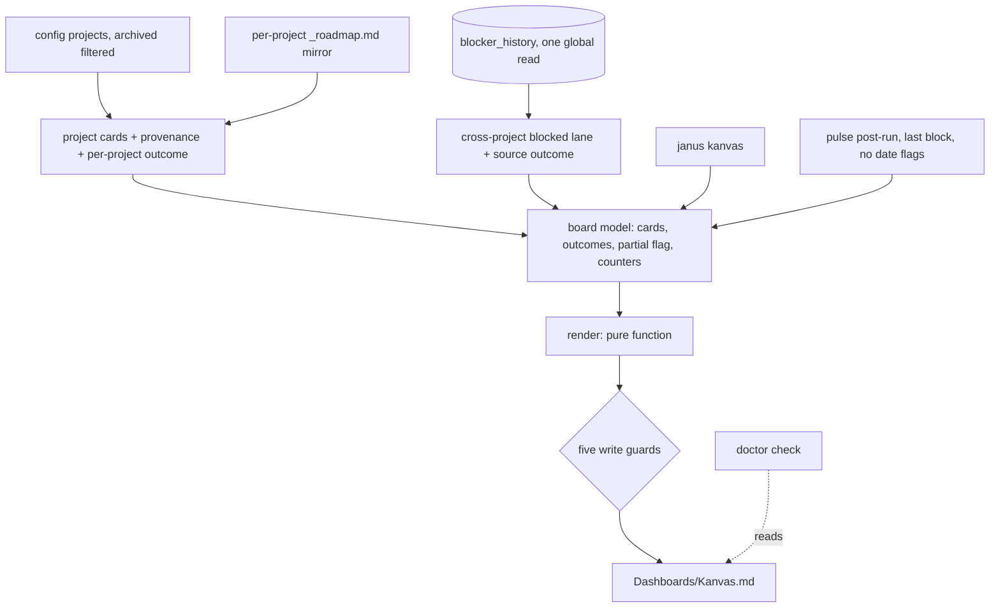
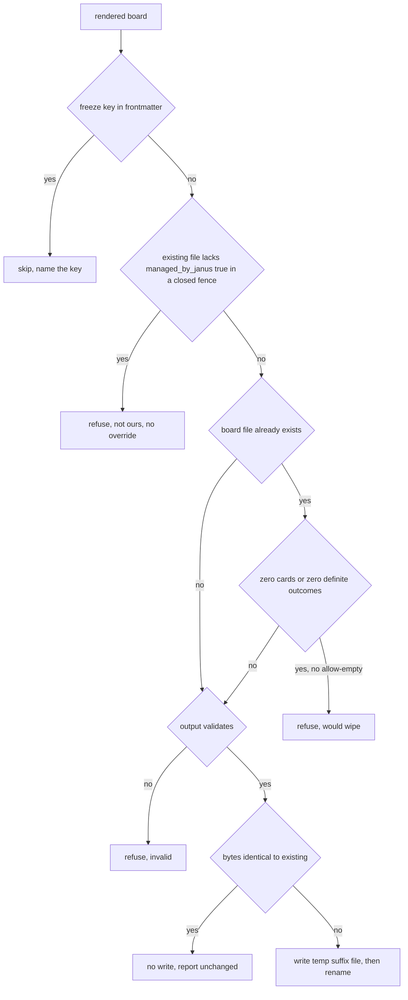

# Janus Kanvas

## Goal Capsule

**Objective:** someone maintaining several projects at once can see, on one page, what is in flight across all of them and what has been reported as blocking — without opening every repo's tracker — and can trust that page to say *unknown* rather than *nothing* when something could not be read.

**Means:** a deterministic cross-project board rendered into the vault from artifacts Janus already writes, with no new authoring surface and no LLM call (KTD1, KTD8).

Authority order:

1. The behavior and scope confirmed in this planning session.
2. `AGENTS.md`, especially privacy, idempotency, dependency, SQLite-migration, and commit-scope rules.
3. Existing vault-writer, pipeline, doctor, search-index, and de-fuse contracts.
4. Current JSON Canvas, Obsidian Tasks, and Dataview documentation, re-verified during implementation.

Stop implementation and open an issue before adding a SQLite table or column, adding a dependency, extending the `DocKind` union, or changing how the weekly rollup records blockers. Do not solve any part of this by writing into a tracked project's repo, by teaching Janus a single project's bespoke file format, or by putting real project names into fixtures, comments, or documentation.

This feature is the second vault artifact in the repo that rewrites itself unconditionally on every run — the idempotency learning names `fixAllRelated` as the only prior exception to overwrite-never-append. That is the reason the write guards in KTD9 exist at all, and why they are not optional polish.

Execution profile: implement locally in dependency order, deterministic-only, and return to the caller once the three repository verification gates pass. Committing, pushing, and opening a PR are outside this plan's execution tail unless requested separately.

---

## Product Contract

### Summary

Janus renders one cross-project board into the vault at `Dashboards/Kanvas.md`. Cards come from two sources that never compete for the same card: **project cards** parsed from the per-project `_roadmap.md` mirror Janus already maintains, and one **cross-project blocked lane** fed by the `blocker_history` table. The board is regenerated wholesale on each nightly run and on demand via `janus kanvas`. It makes no LLM call, writes nothing into any tracked repo, and never reads the board back as input.

### Problem Frame

Janus already tracks every active project, but its output is one artifact per project per day, and its existing cross-project surfaces answer a different question than this one.

Four generated dashboards already aggregate across projects, and they are all *pulse-shaped*: last pulse per project, pulses carrying risks, pulses whose status is drift, projects with no declared roadmap. The MCP tools and `janus ask` add a pull path — you can ask what happened in a project and get narrative back. What none of them shows is **the set of open work items across every project at once, grouped by state**. A pulse table tells you a project was active on Tuesday and had two risks; it does not tell you the four things that project has open and which one is stalled. That is the gap, and it is why the board is a fifth dashboard in placement but not in kind.

The design tension is real and shapes everything below: Janus is retrospective by construction, while a board is forward-looking state. The resolution is that **the board asserts nothing Janus did not already record.** It is a view over artifacts Janus already writes, not a new place to author work. Authoring stays upstream — in the roadmap the maintainer reconciles. This is why no card is invented from prose, why the board is never read back as input, and why it can be deleted and regenerated at any time without losing anything.

### Key Decisions

- KD1. The board is a one-way mirror; edits made to it in Obsidian are never read back as input, and nothing is ever written into a tracked repo (session-settled: user-directed — chosen over persisting hand-moved cards: the vault is a mirror, not a source). Governs R11, R13, R14.
- KD2. Janus learns no per-repo bespoke card format (session-settled: user-directed — chosen over teaching Janus one project's hand-rolled log format: a tool serving many projects must not learn the format one project uses). Governs R1, R8.
- KD3. The board does not replace the issue tracker that lives with the code (session-settled: user-directed — chosen over turning Janus into a per-repo tracker: the board's unique value is cross-project, which a per-repo tracker structurally cannot give). Governs R14.
- KD4. Registering additional projects into Janus is outside this change (session-settled: user-directed — chosen over bundling a first test subject into the same work: registration is two lines of config and is not a prerequisite).

### Requirements

**Card sources**

- R1. Project cards are parsed from each project's `_roadmap.md` mirror in the vault, located with the existing path helper. This is the artifact the roadmap sync already maintains from the repo, so the repo remains the upstream source of truth and Janus reads one canonical shape rather than each repo's own (KD2).
- R2. A card's provenance comes from the mirror's own frontmatter, which already records it: a mirror not marked as needing review is *reconciled* and its cards render as such; otherwise its cards render as *inferred*, visibly marked. Provenance follows that flag alone — a mirror Janus inferred and the user then reviewed has been taken over by a human, whatever wrote it first.
- R3. The blocked lane is a single **cross-project** lane fed by `blocker_history` rows whose `last_seen` falls inside the recency window. Rows are not attributed to projects, because the weekly rollup that writes them records every row under one non-project sentinel key — the lane is labelled for what the data is, and no per-project blocked column is claimed.
- R4. A project that contributes no cards says which of two different things is true, because they are not the same fact and the second is the common one: *no mirror* (absent, or still a pending placeholder), and *roadmap present but carrying no checkbox work items* — a repo-sourced mirror is the repo's roadmap body verbatim, which is usually prose and tables. Reporting the second as "no roadmap" would state something false.
- R5. Projects with `status: "archived"` contribute no cards. Every other status, including `paused`, contributes normally.

**Board integrity**

- R6. Every input has an explicit outcome. Per project: reconciled mirror, inferred mirror, no mirror, roadmap-present-but-unparsed, or unreadable. For the blocked lane: rows in window; *no rows in window*, which renders as unknown rather than as an empty lane and says plainly that it cannot tell "nothing was blocking" apart from "no weekly ran"; or *unreachable*, when the state database is absent — which is distinct from a query returning zero rows.
- R7. When any input fails, the board states that on its face and does not present its counts as complete. Totals are rendered as unknown, never as zero.
- R8. The column vocabulary is fixed and general across heterogeneous projects. An unrecognized source heading coerces to a visible column; no card is ever dropped for having an unmapped heading.
- R9. Card counts reconcile: rendered plus summarized equals the model's card count, both visible in the run result. Rows the model declined to turn into cards — a blocker row outside the window, a mirror that yielded none — are reported on their own line rather than folded into that identity.

**Write safety**

- R10. Regenerating with unchanged inputs at the same injected date produces a byte-identical file, and a run whose output matches the existing file performs no write at all.
- R11. A board the user has frozen is never overwritten. The run reports the skip and names which frontmatter key caused it.
- R12. The board is not overwritten when the model is *degenerate*, defined as: zero cards, or zero projects reached a definite outcome. Overriding this requires `--allow-empty`. A model that lost most but not all of its inputs is rendered and marked partial rather than refused — visible loss is the goal, not a refusal that leaves a stale board looking current. The refusal governs *overwriting* only: when no board file exists yet, a degenerate model still writes the first board, so a new user gets a page that explains itself instead of nothing at all.
- R13. The board is written atomically on the machine that writes it, so a local reader never observes a truncated file.
- R14. Nothing is written into any tracked repo.
- R15. An existing board file that does not carry `managed_by_janus: true` inside a closed frontmatter block is treated as a file Janus does not own and is never overwritten. This covers a file with no frontmatter and one whose fence never closes, both of which the frontmatter splitter reports as having none. `--allow-empty` does not override this guard; the user renames or deletes the file.

**Surfaces**

- R16. `janus kanvas` renders on demand and always prints a result line, including under `--dry-run`, which writes nothing, creates no directory, and makes no LLM call.
- R17. The nightly run refreshes the board even when no project produced a new pulse. A run invoked with an explicit `--date`, `--since`, or `--backfill` does not refresh it, so replaying history never rewrites a current-state artifact.
- R18. `janus doctor` reports a board that is missing once the pipeline has run, and stays green for a user with no card sources, for a fresh install where no pulse has ever been recorded, for a user whose board is deliberately frozen, and for a run that was legitimately partial.

### Key Flows

- F1. Nightly refresh
  - **Trigger:** a scheduled `janus pulse` run, invoked with no date-selecting flags, reaches the end of its post-run sequence.
  - **Steps:** build the model from config, the roadmap mirrors, and `blocker_history`; render; apply the write guards; write.
  - **Outcome:** the board reflects each project's current mirror plus the cross-project blocked lane, or states which inputs it could not read.
  - **Covered by:** R1, R3, R5, R6, R7, R17.

- F2. A project's roadmap becomes reconciled
  - **Trigger:** the maintainer reconciles that project's roadmap and the mirror stops being marked as needing review.
  - **Steps:** the next run reads the mirror's frontmatter and renders its cards as reconciled rather than inferred.
  - **Outcome:** the same cards lose their inferred marking. No card is duplicated, because provenance is a property of the mirror rather than a second source competing for the same card.
  - **Covered by:** R1, R2, R8.

- F3. An input cannot be read
  - **Trigger:** a mirror is absent, or the command runs from a directory with no state database.
  - **Steps:** the failing input is caught and classified; every other input still contributes.
  - **Outcome:** the board names what it could not read and marks its counts incomplete; the run result names the resolved state directory, so a wrong working directory is self-evident.
  - **Covered by:** R6, R7, R12.

- F4. The user takes the board over
  - **Trigger:** the user sets a freeze key in the board's frontmatter, or a file already exists at that path that Janus did not write.
  - **Steps:** the next run detects the freeze from the frontmatter block only, or detects the absent ownership key, skips the write, and reports which condition fired.
  - **Outcome:** the file is byte-identical, and the skip is visible in the run result and in `doctor`, not silent.
  - **Covered by:** R11, R15, R18.

### Acceptance Examples

- AE1. **Given** a vault with an existing board holding cards, **when** a run produces a model in which no project reached a definite outcome, **then** the existing file is left byte-identical and the run reports a refusal.
- AE2. **Given** a project whose mirror has a heading the synonym table does not recognize, **when** the board renders, **then** its cards appear under the default visible column and rendered plus summarized equals the model's card count.
- AE3. **Given** two projects that each have a card with the same title, **when** the board renders, **then** two distinct cards appear, each attributed to its own project.
- AE4. **Given** a board carrying a freeze key in its frontmatter and a model with new cards, **when** the run executes, **then** the file is unchanged and the result names the key that froze it.
- AE5. **Given** the literal text of a freeze key appearing in the board's own instructional prose, **when** the freeze check runs, **then** the board is not treated as frozen, because only the frontmatter block is consulted.
- AE6. **Given** most projects unreadable and one contributing cards, **when** the board renders, **then** it is written, marked partial, names each unreadable project, and renders totals as unknown.
- AE7. **Given** no weekly rollup inside the recency window, **when** the board renders, **then** the blocked lane reads as unknown rather than as empty.

### Success Criteria

- One page shows the open work of every active project grouped by state, and a project missing from it is distinguishable from a project with nothing open.
- The board is reachable from the vault's existing navigation without knowing its filename.
- Running the generator twice with unchanged inputs at the same date changes no bytes.
- A single unreadable input costs that input's cards and nothing else.
- Adding the feature changes no existing vault artifact's content, no SQLite schema, and no dependency.

### Scope Boundaries

**Non-goals**

- Two-way sync with Obsidian (KD1).
- A replacement for the issue tracker that lives with each repo (KD3).
- Per-repo bespoke card parsers, including the heading-with-status-marker and status-table shapes that two tracked repos use today (KD2).
- Any write into a tracked repo, which would reverse the decision that removed repo-side pulse copies.
- Inventing cards from pulse prose.
- Changing how the weekly rollup records blockers. Per-project blocker attribution does not exist today; adding it would touch a table the stuck-pattern detector shares and would need a backfill, so the lane is cross-project instead (R3).
- Extending `janus enrich` or `janus retry` to refresh the board. The board has its own verb and a nightly refresh.
- A `--project` flag. With no persistence, every other project's slice must be rebuilt anyway, so the flag could not change the output.

**Deferred to follow-up work**

- A `.canvas` renderer over the same model (KTD1 records the evidence and what would change the call).
- Per-project boards, which are largely redundant with each repo's own tracker.
- Per-project blocker attribution, and the per-project blocked column it would unlock.
- Indexing the board into the FTS store (KTD7).
- Any agent-facing read surface (KTD13).
- Adding the board to `janus demo`'s synthetic vault, whose fake projects are otherwise ideal neutral fixture material.

---

## Planning Contract

### Key Technical Decisions

- KTD1. **Markdown for v1, not `.canvas`.** Three findings decide it. Obsidian's own help documents that canvas text cards are excluded from backlinks, and canvas file content is not reachable from global search — a board of text nodes would be invisible to the person it is for. JSON Canvas carries no frontmatter, so `isFrozen()` in `src/core/frontmatter.ts` — the only mechanism this repo has for protecting a hand-edited vault file — cannot apply to it. And JSON Canvas group containment is geometric rather than declared, so the generator must recompute every member coordinate in lockstep or visual containment silently breaks. The honest counterweight, recorded so a future reader does not have to rediscover it: canvas is the only one of the two that renders a true side-by-side board, and neither Tasks nor Dataview has a column primitive either. KTD2 is what makes that counterweight survivable. Revisit if the board is wanted as a spatial artifact rather than a status page.
- KTD2. **The renderer emits its own columns as a static table; it does not delegate to a query plugin.** Janus already owns the card data, so a Dataview or Tasks query would only re-derive from notes Janus just wrote, inheriting both plugins' lack of a column primitive and their refresh caveats. This is also what distinguishes the board from the four incumbent dashboards in the same directory, which are Dataview views over pulse frontmatter: they can group pulses, but neither plugin can lay out work items in columns without hand-written JavaScript. A generated table needs no plugin at all, diffs cleanly, and is byte-stable.
- KTD3. **Two sources, two families of column, never merged per card.** Project cards fill the working columns; the cross-project blocked lane stands apart. This removes the promotion problem *in the data model*: with no per-card merge there is no identity handshake, no suppression record, and no tombstone to keep. It does not remove it for the reader — a blocker that is also written as a work item appears twice, once in each family, until the blocker row ages out of the window. That residual duplication is an accepted cost recorded in the risks table, not a solved problem.
- KTD4. **Cards come from the roadmap mirror; blockers from `blocker_history`; nothing from prose.** The repo-side probe this plan originally specified was measured against the real projects and rejected on evidence: of eight active projects, two have a roadmap file at any probed path and neither contains a single checkbox line, so a repo-side board would render placeholders for every project on day one. The vault mirror is the populated artifact — it carries checkbox lines for most projects, and its frontmatter already records the provenance this plan would otherwise have to invent, which is why R2 reads provenance rather than deriving it. Reading it does not weaken the repo-is-source-of-truth contract: the mirror is produced *from* the repo, and aggregating one Janus artifact into another is what the spine and the rollups already do. Two honesty notes for a future reader. First, the mirror's inferred variant is pulse-derived, which is why those cards render as inferred rather than silently equal to reconciled ones. Second, `blocker_history` is *structured storage of a prose scrape*: the weekly writer extracts blockers from LLM-written weekly markdown by matching callouts and headings, so the fragility that broke an earlier roadmap-from-pulse parser is one hop upstream rather than eliminated. R6's no-weekly-in-window outcome exists so that fragility surfaces as unknown instead of as an empty lane.
- KTD5. **Card identity is scoped to its family.** A project card is identified by its project plus a slug of its title, because nothing enforces unique titles across projects and sibling projects will legitimately both have a card called "auth". A blocked-lane entry is identified by its blocker hash alone, since the rows carry no project. The lane renders each entry's `last_seen` date and never derives an age from `first_seen`: that column is not reset when a blocker recurs after a gap, so any duration computed from it would assert a continuity that did not happen.
- KTD6. **The board lives in `Dashboards/`, emits exactly one inline-flow tag line, and links to nothing.** The load-bearing guarantee against re-fusing the graph that the de-fuse work exists to separate is that cards carry plain text and tags, never wiki-links. The directory is a second layer, not the primary defence: the graph search filter lives in `.obsidian/graph.json` and only exists for a user who has run `janus graph`, and it filters the global graph view rather than backlinks. Because `defuseVault` walks that directory and adds the canonical tag for a dashboard-typed file, the renderer must emit `tags: [type/dashboard]` verbatim as an inline flow array — the tag editor matches inline flow only, so a block-style list would make it append a second tag line that the next render strips, churning the file forever and rewriting it through a non-atomic path. The board is deliberately absent from the scaffold generator's file list, whose contract is create-or-skip; adding it there would freeze the board at its first version.
- KTD7. **The board is not indexed into the FTS store, and this costs no code.** The vault scanner walks only the projects tree and a fixed flat-directory list, and `Dashboards` is in neither — so this is the default rather than something to enforce. It is recorded as a decision because it is load-bearing for KTD13 and because the alternative is tempting: indexing would put superseded card text into `ask` answers, float one keyword-dense document above unrelated queries, and require reconciliation for a doc that changes shape nightly.
- KTD8. **Fully deterministic — zero LLM calls.** Structure, ordering, placement, and counts all derive from data. This keeps `--dry-run` honest, makes backfill cost nothing, avoids the runner failure class where a subprocess writes the target file itself, and is what makes byte-stable regeneration achievable at all.
- KTD9. **Five write guards, in a pinned order:** honor the freeze flag read from the frontmatter block only; refuse a file Janus does not own (R15); refuse a degenerate model over an existing board (R12) unless `--allow-empty`; validate the rendered output; write atomically. Validation follows the spine writer's four checks — non-empty, starts with frontmatter, frontmatter closes, body above a floor — but returns a named result rather than throwing, because the caller needs to report which guard fired. Two precedents are cited precisely because it is easy to misremember them: the spine writer validates but then writes non-atomically, and the only temp-file-plus-rename in the repo is in the Codex init path, using a `.janus.tmp` **suffix**. Kanvas follows that suffix — a fixed `Kanvas.md.janus.tmp` in the same directory — rather than a dot prefix, so a leftover from a crash is visible to the user in Obsidian rather than hidden, and so it matches neither the de-fuse glob nor any `.md` filter. The result-struct shape to copy is `SyncResult.details[].status`, not the spine writer's throw.
- KTD10. **Per-input failure isolation, with the partial state surfaced on the board.** Each project's mirror read is wrapped individually, following the spine writer's caller loop — except that its catch *discards* the failure, and this one must *classify* it so R6 can distinguish quiet from broken. A board silently missing two projects is worse than a failed run, because it looks correct.
- KTD11. **No persistence and no schema change.** The model is built in memory and rendered in the same pass, so there is no state file to go stale or to wipe a board from the wrong working directory. `blocker_history` is read through the existing query with no arguments and filtered and sorted in TypeScript: that adds no method to the shared checkpoint module and costs one round trip. Because the lane is cross-project (R3), no per-project partition is needed and no row is discarded for carrying an unrecognized project key.
- KTD12. **`today` is injected, never read from the clock inside the writer,** and the blocked lane is ordered by `last_seen` descending with an explicit tie-break on the blocker hash. It is deliberately *not* ordered by `weekly_count`: that counter only advances when a later weekly restates a blocker in identical normalized text, and in practice every row sits at one, so ordering by it would be ordering by a constant.
- KTD13. **No agent-facing surface in v1.** `AGENTS.md` admits new MCP tools for data Janus already indexes, and KTD7 keeps the board out of the index — so a board tool is blocked on reversing KTD7, not merely deferred. When a concrete consumer appears, the cheaper shape is likely a field inside a project-context tool rather than a sixth tool: it would reach every session, touch no pinned tool count, and need no indexing. Note for whoever picks this up: that tool does **not** exist on this branch's base — the MCP server here has four tools, and `janus_get_project_context` lives on the unmerged Codex-integration branch. Whichever lands first, this decision should be re-derived rather than assumed. The pinned count is a cost, not the reason.

### High-Level Technical Design

Inputs, model, and surfaces. The model is the only component that touches the vault mirrors or SQLite; the renderer is a pure function of the model, which is what makes byte-stability testable without a filesystem.

The write guards, in the order KTD9 pins. Each refusal is reported and names itself; no path writes silently.

Column derivation is a normalization, not a parse. A checkbox line's nearest preceding heading is lowercased, stripped of emoji and punctuation, and prefix-matched against a synonym table; a checked box is Done regardless of heading; an unmatched heading coerces to the default visible column. The precedent is `normalizeTrackStatus` in `src/core/tracks.ts`, which does exactly this and is **bilingual** — its synonym table carries Spanish and English stems side by side. The board's synonym table must do the same: the mirrors in the vault today carry headings in both languages. The persistence-boundary half of that pair is deliberately absent here: with the model in memory there is no boundary to lock.

### Assumptions

- The four fixed columns — working-now, next, blocked, done — are general enough for heterogeneous projects. The mirrors' current headings map onto them cleanly, and the bilingual synonym table is the adjustment surface if a project's headings do not land where expected.
- Concrete values, chosen here rather than left to the implementer because they are baked into byte-stable output and into every fixture: **twelve cards per column**, with the remainder summarized by count, and a **twenty-eight-day** blocker recency window. The window is four weekly periods, comfortably above the two-period floor below which the lane would flicker empty between rollups.
- The blocked lane reports what a weekly last said, not verified current state. Nothing retires a row when a blocker is resolved — `last_seen` only advances when a later weekly restates it, and the row simply ages out of the window — so the lane can carry a stale positive for up to the window's length. It is labelled by what it is, carrying each entry's last-reported date, rather than as current blocking state.
- `blocker_history` is written only by the weekly rollup path. Two consequences beyond the staleness above: the lane exists only for users who run weekly rollups, and a fresh blocker can be up to a week old by construction.

### Sequencing

U1 and U7 build the two halves of the model and must land in that order, since U7 owns the assembly. U2 makes the model renderable and safe to write. U3, U4, U5, and U8 attach the surfaces and can land in any order once U2 is in. U6 closes documentation.

### System-Wide Impact

- **Nightly pipeline.** The existing post-run sequence is wrapped in a single conditional requiring that at least one project produced a successful pulse. R17 forbids adding the board inside it: the board must be a new sibling block, guarded on dry-run and run shape alone, placed **after the weekly self-heal**, because `blocker_history` rows are written by the weekly path and an earlier placement would miss a freshly generated weekly's blockers by a day. The gate is the run's *shape* — no explicit date, since, or backfill — and not its dates: every path, nightly and backfill alike, ends at yesterday, so a maximum-date comparison can never separate them and a current-date test would never fire at all.
- **De-fuse pass.** The board is a new file inside a directory that pass already walks. Tag convergence is a hard requirement, and it protects atomicity as well as churn: the de-fuse pass writes non-atomically, so a board it decides to edit every night is also a board being rewritten without the rename guarantee (KTD6, KTD9).
- **Doctor.** `janus doctor` exits non-zero when any check fails, and `janus init` runs doctor. A check that goes red before the feature has had a chance to run once would turn onboarding red — which is why R18's green conditions include a fresh install, not only a user with no card sources.
- **Dashboard navigation.** Every existing dashboard is linked from the hub generator, four sites in the MOC generator, the vault-enrich pass, and the other dashboards' own shortcut lines. Without U8 the board would be the only one nothing points at. Three of those four families are create-or-skip — the hub generator, the MOC generator, and the dashboards generator itself all skip a file that already exists — so edits there reach only new vaults. Only the enrich pass regenerates its file every run and therefore reaches existing ones.
- **Command inventories.** Three surfaces enumerate the verb list and all three drift: the skill's intent-to-command routing table, which is git-tracked and symlinked into the user's skills directory, so a verb missing there is unreachable for skill users; the architecture doc's command table; and the README.
- **Search index, MCP server, SQLite schema, dependencies, prompts, the weekly blocker writer.** Untouched by design.
- **Tracked repos.** Not read and not written. The board reads the vault mirror that the roadmap sync already produces from them.

### Risks and Mitigations

| Risk | Mitigation |
|---|---|
| A wrong working directory yields an empty state database with no error, silently emptying the blocked lane | The blocker source has its own outcome: absent state database is *unreachable*, which sets the partial flag; the run result prints the resolved state directory (R6, F3) |
| A first run destroys a board the user made by hand at the same path | The renderer stamps positive ownership, and any existing file without that key in a closed frontmatter fence is refused — including one with no frontmatter at all, which the splitter reports the same way. No flag overrides this (R15) |
| An accidental freeze kills the feature for every project at once | The board never emits the review key that users are taught elsewhere to flip; the skip names which key fired; and the documented recovery is to delete the file, which costs nothing because the board is fully derived (R11, U6) |
| A partial model overwrites most of the board | Render-and-mark rather than refuse, with refusal reserved for a degenerate model over an existing board; a ratio guard is rejected because it would require parsing Janus's own markdown back into a model — the exact failure KTD4 records (R12, AE6) |
| The nightly refresh silently never fires, or a backfill rewrites the board as history | The gate is run shape, not run dates, matching the discriminator the catch-up path already uses (R17) |
| The blocked lane reads as empty when the weekly parse drifted or no weekly ran | A distinct no-weekly-in-window outcome renders as unknown (R6, AE7) |
| The lane asserts a blocker that was already resolved | The lane is labelled as last-reported with its date, never as verified current state; the window bounds how long a stale positive survives (Assumptions, KTD5) |
| A blocker and a work item describing the same trouble both appear | Accepted and named: KTD3 removes the duplication in the data model, not for the reader. The two live in different column families and the blocked entry ages out on its own |
| The de-fuse pass and the renderer fight over tags, churning the file through a non-atomic write | The renderer emits the canonical tag as an inline flow array; a convergence test runs both passes in both orders (KTD6) |
| Obsidian reads a half-written board | Fixed-name temp file with a suffix that matches no markdown glob, then rename in the same directory (R13) |
| A synced vault produces conflict copies in the dashboards directory that no pass ever cleans | R13 is scoped to the writing machine; the doctor check reports sibling files sharing the board's basename; the documentation states the board should be generated on one machine |
| The partial-project list in frontmatter flips nightly when an input flaps | Accepted and recorded: the partial state is the data. Named here so it is not later diagnosed as an idempotency bug |
| Real project names leak into a public repo | Neutral fixture names throughout, and the diff is grepped before it is pushed |

---

## Implementation Units

### U1. Project cards from the roadmap mirrors

**Goal:** produce project cards with provenance and a per-project outcome for every active project.

**Requirements:** R1, R2, R4, R5, R6, R8, KD2.

**Dependencies:** none.

**Files:**
- `src/core/kanvas.ts` (new — mirror reading, provenance, column normalization)
- `tests/kanvas.test.ts` (new)

**Approach:**
1. Iterate active projects from config, filtering archived explicitly at this site rather than relying on a caller (R5).
2. Locate each mirror with the existing path helper in `src/core/obsidian.ts` rather than composing the path by hand. No new source-precedence logic is introduced and no existing module is modified: the repo-side probe stays where it is, owned by the roadmap sync.
3. Wrap each project individually. The catch must *classify* the failure, not discard it as the spine writer's loop does (KTD10, R6).
4. Read provenance from the mirror's frontmatter with the shared frontmatter reader — never a fifth ad-hoc parser — and classify the mirror as reconciled, inferred, pending, or unreadable (R2).
5. Parse checkbox lines with their nearest preceding heading, and derive the column by bilingual normalization with a coercing fallback (R8).

**Patterns to follow:** `normalizeTrackStatus` in `src/core/tracks.ts` for the column normalizer, including its bilingual stems; `readFreezeFlags` in `src/core/frontmatter.ts` for reading frontmatter scalars; the injected-date convention of the spine writer (KTD12).

**Test scenarios:**
- A mirror with a recognized in-progress heading followed by an unchecked checkbox lands that card in the working-now column.
- A mirror not marked as needing review yields cards marked reconciled; one sourced from pulse inference yields cards marked inferred; the two are distinguishable in the model.
- A mirror that is still a pending placeholder yields the no-source outcome rather than zero cards from a found source.
- A missing mirror file yields the no-source outcome; a mirror whose read throws yields the unreadable outcome, and every other project's cards survive.
- An archived project with a populated mirror contributes nothing; a paused project contributes normally.
- A heading outside the synonym table places its cards in the default visible column and the card count is unchanged.
- A Spanish heading maps to the same column as its English counterpart.
- A checked checkbox lands in the done column regardless of its heading.
- Two projects with identically titled cards produce two distinct card identities.
- Degenerate markdown does not throw and does not silently drop: a checkbox before any heading, an indented checkbox, and a mirror path that resolves to a directory.

**Verification:** all four per-project outcomes are distinguishable, and no input shape produces an exception that escapes the collector.

### U7. Cross-project blocked lane and model assembly

**Goal:** read blockers into one cross-project lane and assemble the board model with its outcome and counter contract.

**Requirements:** R3, R6, R7, R9, KTD3, KTD5, KTD11, KTD12.

**Dependencies:** U1.

**Files:**
- `src/core/kanvas.ts` (modify)
- `tests/kanvas.test.ts` (modify)

**Approach:**
1. Read the blocker table once with no arguments and filter and sort in TypeScript. The existing query has no last-seen filter, and adding one would change a query the stuck-pattern detector shares (KTD11).
2. Treat an absent state database as an unreachable *source*, not as zero rows, and set the partial flag from it (R6). This is the failure with no error to catch, because opening a missing state directory creates an empty database.
3. Distinguish a third outcome: rows exist but none falls inside the window, and no weekly was recorded in it either — render the lane as unknown rather than empty (R6, AE7).
4. Build one cross-project lane. Do not partition by project and do not discard a row for carrying an unrecognized project key (R3).
5. Sort by `last_seen` descending with a tie-break on the blocker hash (KTD12).
6. Assemble both families into one model carrying per-input outcomes, the partial flag, and the counters R9 requires, with declined rows reported on their own line rather than folded into the rendered-plus-summarized identity.

**Patterns to follow:** the result-struct shape of `SyncResult.details[].status` for per-input outcomes.

**Test scenarios:**
- Rows inside the window appear in the lane; rows outside it do not, and are reported as declined.
- The state database file is absent: the lane's source is reported unreachable, the partial flag is set, and the lane is not rendered as empty.
- A build against an empty state directory reports unreachable rather than zero rows.
- Rows exist but none is in window and no weekly was recorded in it: the lane renders as unknown.
- Rows carrying a project key that matches no configured project still appear in the lane, since the lane is cross-project.
- Two entries with identical `last_seen` render in a deterministic order across a database close and reopen.
- Ordering does not change when every row carries the same `weekly_count`.
- Rendered plus summarized equals the model's card count.
- Building twice from unchanged inputs at the same injected date yields an identical model, including card order.

**Verification:** every input has an explicit outcome, and the counters reconcile for every fixture in the suite.

### U2. Markdown renderer and guarded vault write

**Goal:** render the model and write it without any path that can destroy user data.

**Requirements:** R7, R10, R11, R12, R13, R14, R15, KD1, KTD1, KTD2, KTD6, KTD9.

**Dependencies:** U7.

**Files:**
- `src/core/kanvas.ts` (modify — renderer and writer)
- `tests/kanvas.test.ts` (modify)

**Approach:**
1. Emit frontmatter carrying `tags: [type/dashboard]` verbatim as an inline flow array, `managed_by_janus: true`, and the expected and failed input lists. Do not emit the review key at all — it also freezes, and it is the key users are taught elsewhere to flip once they have read something (KTD6, R11, R15).
2. Render columns as a generated table, capped at twelve cards per column with the remainder summarized by count. Render the blocked lane separately, labelled as cross-project and last-reported, each entry carrying its date.
3. Attribute cards with plain text and tags, never wiki-links (KTD6).
4. Render the no-source placeholder for a project whose mirror is pending or missing, a distinct line for each unreadable input, and totals as unknown whenever the partial flag is set (R4, R6, R7).
5. Express the freeze escape hatch and the delete-to-unfreeze recovery in prose or a code span, never as a bare key-value line in the body (AE5).
6. Create the target directory before writing, but not under `--dry-run`, which must leave the vault untouched including its directory shape.
7. Apply the five guards in the pinned order, returning a result that names which one fired. Validation follows the spine writer's four checks but returns rather than throws (KTD9).
8. Write to a fixed `Kanvas.md.janus.tmp` in the same directory, then rename. A fixed name means the next run overwrites exactly one leftover instead of accumulating garbage in the user's vault.

**Execution note:** write the byte-stability test and the refuse-to-wipe test before the writer. This is the repo's stated convention for a new artifact, and these two guards are the ones whose absence is unrecoverable.

**Patterns to follow:** the empty-scan refusal in the index command, whose comment carries the right reasoning for refusing a degenerate result. `readFreezeFlags` and `isFrozen` from `src/core/frontmatter.ts` as the single freeze predicate. The temp-suffix-then-rename shape in the Codex init path — noting it is the repo's only such precedent and that the spine writer, despite validating, does not write atomically.

**Test scenarios:**
- Rendering twice from an identical model produces byte-identical output.
- Writing when the rendered bytes match the existing file performs no write and reports unchanged.
- A degenerate model does not overwrite an existing board and reports the refusal; with `--allow-empty` it does.
- A degenerate model with no board file present writes the first board (R12's creation carve-out).
- A model where every project is unreadable is refused over an existing board even though lane entries made it non-empty.
- Most projects unreadable and one contributing: the board is written, marked partial, names each unreadable project, and renders totals as unknown.
- An existing board with frontmatter lacking the ownership key is refused and left byte-identical — and `--allow-empty` does not override it.
- An existing board with no frontmatter at all, and one whose fence never closes, are both refused and left byte-identical.
- A board carrying either freeze key in its frontmatter is left byte-identical, and the result names which key fired.
- A board with a freeze key present only in body prose is not treated as frozen.
- Guard order: a board that is both frozen and would be degenerate reports the freeze, not the degeneracy.
- Validation rejects output that does not start with frontmatter, whose frontmatter does not close, or whose body is below the floor — and the existing file survives each rejection.
- A column with more than twelve cards renders twelve and summarizes the rest, and the counters still reconcile.
- After a successful write the target directory contains exactly the board file and no temp file.
- A stale temp file at the fixed path neither breaks the write nor survives it.
- Running the de-fuse pass over the rendered board changes nothing, and rendering after de-fuse changes nothing.
- The de-fuse pass and the vault scanner both ignore the temp file.
- Dry-run leaves the directory's bytes untouched and does not create the directory when it is absent.

**Verification:** every refusal path is named in the result struct, and no test can reach a state where an existing board is replaced by a degenerate one without the override, or where a file Janus does not own is replaced at all.

### U3. `janus kanvas` command

**Goal:** expose on-demand generation with flags whose names mean what they mean elsewhere in this repo.

**Requirements:** R16.

**Dependencies:** U2.

**Files:**
- `src/commands/kanvas.ts` (new)
- `bin/janus.ts` (modify)
- `tests/kanvas-command.test.ts` (new)

**Approach:**
1. Register the verb in the lazy subcommand map and dynamic-import into the core, so the compiled binary keeps working.
2. Parse `--dry-run` and `--allow-empty`. The override is deliberately not called `--force`: in this repo that flag means "reprocess even if already done", a non-destructive override of idempotency, and reusing it for a data-destroying meaning would overload an established name.
3. Always print a result line naming the outcome, the counters, the resolved state directory, and which guard fired if any. A silent run is indistinguishable from a crash.

**Patterns to follow:** the graph command for the minimal deterministic-generator shape — but not for its reporting, since it prints nothing when it does not write. The de-fuse command is the reporting precedent: mode, counters, and next-step guidance on every run.

**Test scenarios:**
- `--dry-run` writes nothing, makes no LLM call, and still prints a result line.
- `--allow-empty` lets a degenerate model replace an existing board; without it the same input is refused and the refusal is printed.
- `--allow-empty` overrides neither a frozen board nor the ownership guard.
- The result line names the resolved state directory, so a run from a directory with no state database is self-evident.

**Verification:** the verb resolves from the subcommand map and reports every refusal rather than exiting silently.

### U4. Nightly pipeline participation

**Goal:** refresh the board once per nightly run, including on quiet nights, without rewriting it when history is being replayed.

**Requirements:** R17.

**Dependencies:** U2.

**Files:**
- `src/pipeline/orchestrator.ts` (modify)
- `tests/kanvas-pipeline.test.ts` (new)

**Approach:**
1. Add a new top-level block guarded on dry-run and run shape, placed **after** the existing post-run conditional rather than inside it. That conditional additionally requires at least one successful pulse and wraps enrich, the scaffold group, and both self-heal passes; inserting the board there would break R17 on exactly the quiet nights it was written for.
2. Gate on the run's shape — no explicit date, since, or backfill — reusing the discriminator the catch-up path already applies. Do not gate on dates: the scheduled job runs the bare verb and every path ends at yesterday, so a current-date test never fires and a maximum-date test cannot separate a nightly run from a backfill.
3. Place it last, after the weekly self-heal, so a weekly generated in the same run has already written its blocker rows.
4. Wrap it in the house try/catch that warns non-fatally, and dynamic-import so the compiled binary works.
5. Generate once per run, never as per-project or per-date queue work — the per-project-serial invariant is pinned and must not be disturbed.

**Test scenarios:**
- A run where every project is idle or already done still refreshes the board.
- A run where every project failed still refreshes the board, since the model reads mirrors and blocker rows rather than this run's pulses.
- A run invoked with an explicit backfill, since, or date does not refresh the board.
- A failure inside the board block warns and neither fails the run nor prevents later work.
- A dry-run pipeline pass writes no board.
- The block runs once per invocation, not once per project, and the serial-queue test still passes.

**Verification:** the board refreshes on a scheduled bare run and does not refresh on a replay, with a test that fails if the gate is moved inside the existing conditional or keyed on dates.

### U5. Doctor check

**Goal:** make a missing board visible without producing a check that cries wolf.

**Requirements:** R18.

**Dependencies:** U2.

**Files:**
- `src/core/doctor.ts` (modify)
- `tests/kanvas-doctor.test.ts` (new)

**Approach:**
1. Export a single check returning the standard check result and register it in the check list.
2. Derive its project set the same way the model does — archived-only filtering — and say so, because the neighbouring pulse-gap check also skips paused projects and would otherwise appear to disagree with this one in the same output.
3. Green in four cases: no project has a card source and no blockers are in window; the pipeline has never recorded a pulse, so the nightly block has not had a chance to run; the board is frozen, with the detail naming the key and the delete-to-unfreeze recovery; the last run was legitimately partial, since partial is a normal state under R7.
4. Red only when the board file is missing after the pipeline has run and card sources exist, or when a stale temp file is present. Name the exact command in the detail.
5. Report sibling files in the directory sharing the board's basename stem, which is how sync conflict copies show up.

**Patterns to follow:** the absent-is-not-broken precedent and the remediation-naming convention of the dead-letter and pulse-gap checks; one describe block per exported check.

**Test scenarios:**
- No card sources and no blockers: green.
- A fresh install with populated mirrors but no pulse ever recorded: green.
- A frozen board with a stale model: green, naming the freeze key and the recovery.
- A board written from a partial run: green with a detail, not red.
- Card sources exist, a pulse has been recorded, and the board file is missing: red, and the detail names the command.
- A stale temp file present: red.
- A sibling file sharing the board's basename is reported.
- The check does not throw when the vault directory or the state directory is absent.

**Verification:** the check cannot be red for a user who has not adopted the feature or has just installed, and `janus doctor` still exits zero for them.

### U8. Inbound navigation

**Goal:** make the board reachable without knowing its filename.

**Requirements:** supports the discoverability success criterion.

**Dependencies:** U2.

**Files:**
- `src/core/enrich.ts` (modify)
- `src/core/scaffold/hubs.ts` (modify)
- `src/core/scaffold/mocs.ts` (modify)
- `src/core/scaffold/dashboards.ts` (modify — the other dashboards' shortcut lines only)
- `tests/kanvas-nav.test.ts` (new)

**Approach:**
1. Add the board to the existing dashboard shortcut lines. This does not conflict with KTD6: that decision governs outbound cross-project links *from* the board, and inbound links into this directory already exist for four files and are filtered out of the graph view.
2. Record the asymmetry in the change itself: the hub generator, the MOC generator, and the dashboards generator are all create-or-skip, so their links reach only new vaults. The enrich pass regenerates the project index every run and is the only one that reaches existing vaults.
3. Do not add the board to the scaffold generator's file list (KTD6).

**Test scenarios:**
- The regenerated project index contains the board link.
- A hub generated into a fresh vault contains the board link.
- An existing hub is not rewritten by the create-or-skip contract, and the test asserts that rather than pretending otherwise.
- The scaffold generator's file list still excludes the board.

**Verification:** the board is reachable from the project index in an existing vault and from the hubs in a new one.

### U6. Documentation

**Goal:** document the surface and record why it belongs, without inheriting the surrounding inaccuracies.

**Requirements:** none directly; supports R16 and R18.

**Dependencies:** U3, U4, U5, U8.

**Files:**
- `README.md` (modify)
- `AGENTS.md` (modify)
- `docs/ARCHITECTURE.md` (modify — both the command table and the vault tree)
- `skill/SKILL.md` (modify — the intent-to-command routing table)
- `CHANGELOG.md` (modify)

**Approach:**
1. Document the verb, its two flags, the card source, the column vocabulary and its caps, the blocked lane's cross-project meaning, the freeze key, and the delete-to-unfreeze recovery.
2. Add the verb to all three command inventories, and add the board to the vault layout. Do not extend the inaccuracies already present in the surfaces being edited: the architecture doc's vault tree still shows the pre-timeline layout and its command table understates the MCP tool count, and the README's vault tree shows a double-dash pulse filename that contradicts the filename convention. Correcting them is out of scope; copying them is the trap.
3. State plainly that the board is neither indexed nor exposed to agents (KTD7, KTD13), and that the blocked lane reports what a weekly last said rather than verified current state.
4. Record why a status board belongs in a tool whose contribution guide welcomes verbs "that fit the temporal-narrative model" — so a reviewer does not bounce it on that clause.
5. Note that the board deliberately has no thin script wrapper, unlike every sibling vault generator, because it has a real CLI verb instead.

**Test expectation:** none — documentation only. The conventional commit scope for this unit is `docs`.

**Verification:** a reader who has never seen the feature can find the board and understand what each column claims from the documentation alone.

---

## Verification Contract

| Gate | Command | Applies to | Done signal |
|---|---|---|---|
| Unit tests | `bun test` | U1–U5, U7, U8 | Whole suite green, still fast, no new flake |
| Types | `bunx tsc --noEmit` | all units | Clean |
| Binary smoke | `bun run scripts/smoke-validate-phase1.ts` | U3, U4 | Passes unchanged, and its check count is unchanged because this plan adds no smoke check. It asserts nothing about the subcommand surface — the only pinned surface is the MCP tool count, which KTD13 leaves untouched. It does compile the CLI entrypoint and run a dry-run pulse through the orchestrator, so it is the gate that catches a regression in U4's dry-run guard |
| Byte stability | `tests/kanvas.test.ts` | U2 | Two consecutive renders at the same date are byte-identical and the second performs no write |
| Convergence | `tests/kanvas.test.ts` | U2 | Renderer and de-fuse pass reach a fixed point in either order, and neither pass sees the temp file |
| Privacy | Grep the diff before pushing | all units | No real project, product, client, or path names in fixtures, comments, or docs |

Tests follow the repo's no-real-model, no-real-vault convention: a temp directory per test, neutral fixture names, injected dates, and no subprocess. Two deviations are required and deliberate. At least one test must use an **on-disk** state directory, including the case where it does not exist — an all-in-memory suite structurally cannot catch the absent-database failure in U7. And at least one ordering test must close and reopen the database, since two builds against one open handle cannot surface a physical-row-order change.

One thing no gate can prove: every test runs on fixtures, so none of them observes how many cards the board renders against the real vault. Before U6 is called done, run the verb once against the real vault and confirm the board is non-empty and its counts match what the mirrors contain.

---

## Definition of Done

Global:

- Every requirement R1–R18 is either implemented or explicitly deferred in this document.
- All six verification gates pass, plus the one-time real-vault check named above.
- No SQLite schema change, no new checkpoint method, no change to the weekly blocker writer, no new dependency, no `DocKind` change, no MCP tool, and no prompt file were added.
- No existing module's behavior changed: the roadmap sync, the weekly path, and the search index are untouched.
- Nothing is written into any tracked repo by any code path in this change.
- Abandoned experimental code from approaches that did not pan out is removed rather than left in the diff.

Per unit:

- U1: all four per-project outcomes are distinguishable, provenance comes from the mirror's frontmatter, and no input shape throws.
- U7: every input has an explicit outcome, an absent state database is unreachable rather than empty, no-weekly-in-window is unknown rather than empty, and the counters reconcile.
- U2: the five guards fire in the pinned order, each refusal is named, a file Janus does not own is never overwritten, and regeneration is byte-stable.
- U3: the verb is registered, `--allow-empty` carries the degenerate override alone, and every run prints a result line.
- U4: the board refreshes on a scheduled bare run, skips a replay, and the serial-queue test still passes.
- U5: the check is green for a non-adopter, a fresh install, a deliberate freeze, and a partial run; red only with a named remediation.
- U8: the board is reachable from the project index in an existing vault, and the scaffold file list still excludes it.
- U6: all three command inventories list the verb, and none of the surrounding stale content was copied forward.

---

## Appendix

### Sources and Research

Repository evidence, current as of this plan's date and worth re-verifying during implementation:

- `src/core/obsidian.ts` — the mirror path helper U1 uses, and the shared write shape.
- `src/core/sync-roadmaps.ts` — the upstream producer of the mirror, its source precedence, and the frontmatter provenance fields R2 reads. Not modified by this plan.
- `src/core/frontmatter.ts` — the frontmatter-block-only freeze predicate, its two negative-polarity keys, and the inline-flow-only tag matcher that KTD6 depends on.
- `src/core/tracks.ts` — the bilingual, emoji-stripping normalizer that is the precedent for column derivation.
- `src/core/spine.ts` — validate-before-overwrite and its stated reasoning, per-project isolation in the caller loop, and the injected-date convention. It is not a precedent for atomic writes.
- `src/core/init/codex.ts` — the repo's only temp-file-plus-rename, using the suffix KTD9 adopts.
- `src/core/scaffold/dashboards.ts` — the four incumbent cross-project views, and the create-or-skip contract the board deliberately does not join.
- `src/core/graph-config.ts` — the graph search filter, and why it is a second layer rather than the primary defence.
- `src/core/defuse.ts` and `src/core/note-classify.ts` — the directories the de-fuse pass walks, the single canonical tag it adds to a dashboard-typed file, and its non-atomic write.
- `src/core/checkpoint.ts` — the blocker table shape and the existing query's lack of a recency filter.
- `src/core/weekly.ts` and `src/core/reflection/stuck-patterns.ts` — the only writer of blocker rows: it records every row under one sentinel project key, and it derives blockers by matching callouts and headings in LLM-written weekly markdown. Both facts are load-bearing for R3, R6, and KTD4.
- `src/core/search-index.ts` — the markdown-only scan and the flat-directory list that together make KTD7 free.
- `src/mcp/server.ts` — four read-only tools on this branch. An earlier count of five came from reading the working tree while a sibling feature branch was checked out.
- `src/core/doctor.ts` — the check result shape, the absent-is-not-broken precedent, the remediation-naming convention, and the paused-project divergence U5 must explain.
- `src/pipeline/orchestrator.ts` — the post-run conditional, the run-shape discriminator U4 reuses, and the per-project-serial queue invariant.
- `docs/solutions/` — the idempotency, deterministic-fallback, and vault-write learnings behind KTD8, KTD9, and KTD12, and the testing conventions the Verification Contract cites.

External documentation consulted for KTD1 and KTD2, to be re-checked before a canvas renderer is attempted:

- JSON Canvas specification 1.0 — node types and required fields, the preset color set, the absence of any declared parent-child relationship for group nodes, and the integer pixel coordinate system.
- Obsidian Canvas help — text-only cards are excluded from backlinks; file cards embed a real note.
- Obsidian Tasks documentation — the emoji and inline field formats, custom statuses, and grouping that renders as nested headings in a single vertical flow rather than as columns.
- Dataview documentation — query forms, identical treatment of frontmatter and inline fields, and the absence of any column primitive without hand-written JavaScript.
